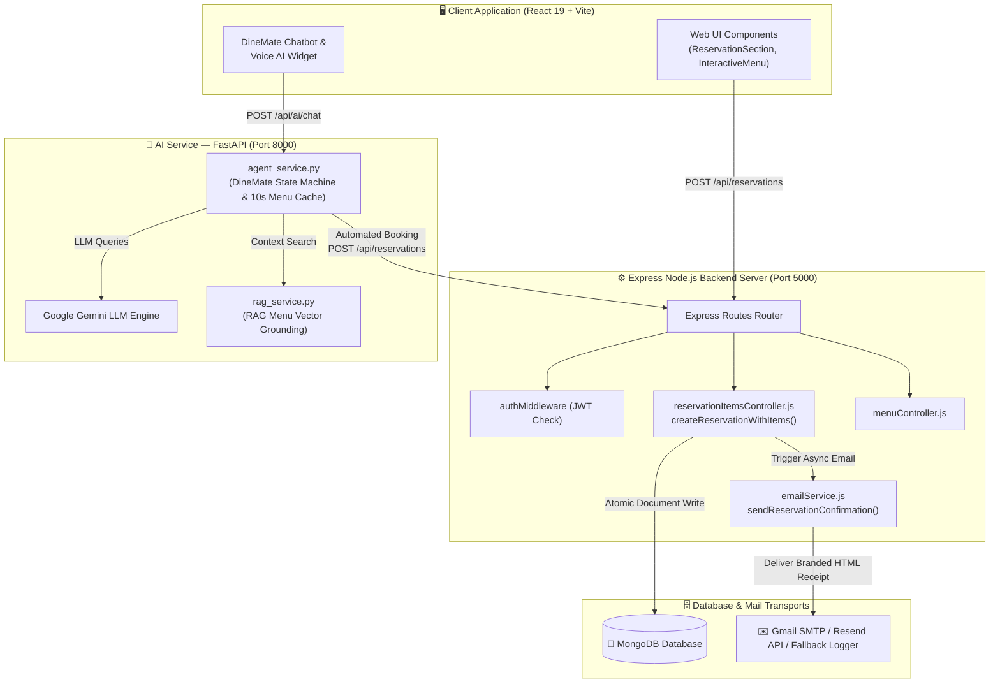
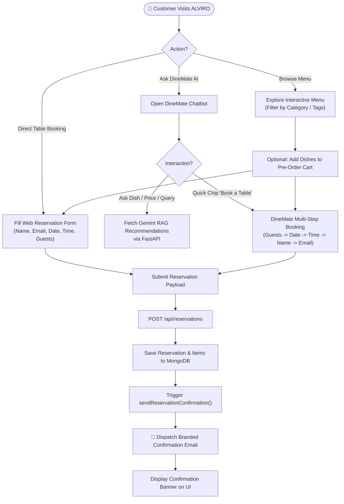
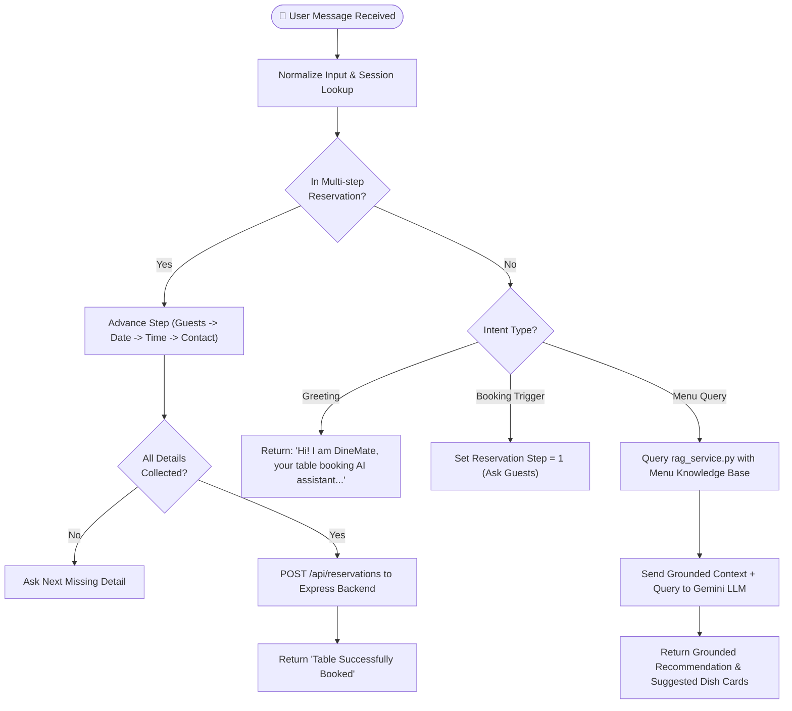
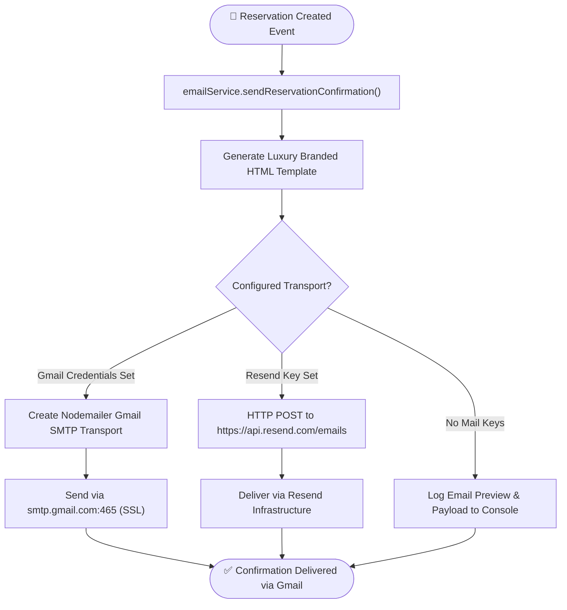
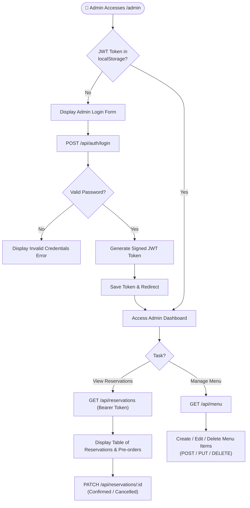
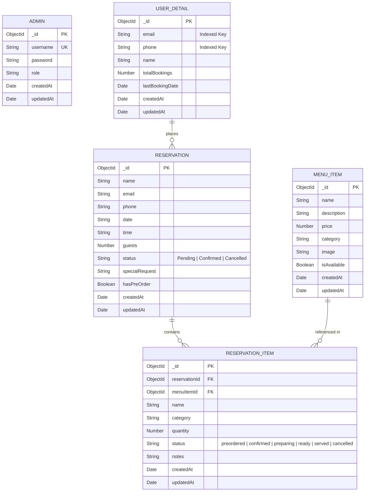

# 🍽️ ALVIRO — Technical Documentation & Developer Guide

<div align="center">


**Complete technical reference, architecture documentation, and workflow guide for the ALVIRO Fine Dining & AI Platform.**

[](https://react.dev/)
[](https://vitejs.dev/)
[](https://tailwindcss.com/)
[](https://expressjs.com/)
[](https://www.mongodb.com/)
[](https://fastapi.tiangolo.com/)
[](https://ai.google.dev/)
[](https://nodemailer.com/)

</div>

---

## 📌 Table of Contents
- [1. Executive Summary](#1-executive-summary)
- [2. Recent Technical Enhancements](#2-recent-technical-enhancements)
- [3. Project Structure & Tech Stack](#3-project-structure--tech-stack)
- [4. Overall System Architecture](#4-overall-system-architecture)
- [5. System Workflows & Flowcharts](#5-system-workflows--flowcharts)
  - [5.1 Customer Journey & AI Assistant Flowchart](#51-customer-journey--ai-assistant-flowchart)
  - [5.2 DineMate AI State Machine & RAG Flowchart](#52-dinemate-ai-state-machine--rag-flowchart)
  - [5.3 Email Notification Transport Engine Flowchart](#53-email-notification-transport-engine-flowchart)
  - [5.4 Admin Operations & JWT Authentication Flowchart](#54-admin-operations--jwt-authentication-flowchart)
- [6. End-to-End Sequence Diagram](#6-end-to-end-sequence-diagram)
- [7. Database Schema & ER Diagram](#7-database-schema--er-diagram)
- [8. API Endpoints Reference](#8-api-endpoints-reference)
- [9. DineMate AI & Voice Engine Details](#9-dinemate-ai--voice-engine-details)
- [10. Email Confirmation Engine](#10-email-confirmation-engine)
- [11. Security, Resilience & Error Handling](#11-security-resilience--error-handling)
- [12. Environment Variables Guide](#12-environment-variables-guide)
- [13. Installation & Getting Started](#13-installation--getting-started)

---

## 1. Executive Summary

**ALVIRO** is an enterprise-grade 3-tier fine dining platform integrating:
1. **React 19 + Vite 7 Frontend**: High-performance luxury UI with dynamic menu filtering, dish pre-ordering, table booking, and interactive voice/text DineMate AI assistant.
2. **Node.js Express 5 API Server**: Secure RESTful backend handling transactional reservations, relational dish pre-orders in MongoDB, JWT authentication, and automated branded email confirmations.
3. **Python FastAPI DineMate AI Service**: Advanced AI agent powered by Google Gemini LLM and RAG vector retrieval, enabling natural conversation, intelligent menu recommendations, and multi-step automated table reservations.

---

## 2. Recent Technical Enhancements

- 🤖 **Refined DineMate AI Persona & Quick Suggestions**:
  - Warm, professional AI greeting: *"Hi! I am DineMate, your table booking AI assistant. How may I assist you?"*
  - Context-aware quick prompt chips: `"Show me the full menu"`, `"Vegetarian under $500"`, `"Pre-order dinner"`, and `"Book a table"`.
- 📧 **Automated Email Booking Notifications**:
  - Integrated Nodemailer SMTP (Gmail) and Resend API transports with automatic fallback to logging mode.
  - Branded luxury HTML confirmation receipts sent automatically upon table reservation.
  - Dedicated verification script `server/scripts/testEmailService.js`.
- ⚡ **Performance & Stability**:
  - Implemented 10-second TTL menu caching in `agent_service.py` for sub-second AI menu querying.
  - Hardened Python typing across AI services (`Tuple`, `List`, `Dict`, `Optional`).
  - Added atomic rollback transaction protection when creating reservations with pre-ordered dishes.

---

## 3. Project Structure & Tech Stack

### 🖥️ Stack Overview

| Subsystem | Core Technologies | Primary Responsibilities |
|---|---|---|
| **Client (`/client`)** | React 19, Vite 7, TailwindCSS 3, Framer Motion, Lucide Icons, Axios | Dynamic UI, menu filter, pre-ordering, DineMate voice/chat widget, dark mode theme. |
| **Server (`/server`)** | Node.js, Express 5, Mongoose 9, JWT, bcryptjs, Nodemailer | Express REST API, MongoDB models, JWT middleware, booking transactions, email dispatch. |
| **AI Service (`/ai_service`)** | Python 3.11+, FastAPI, Google Gemini SDK, RAG Vector Search | DineMate conversational agent, RAG menu grounding, multi-step reservation state machine. |

### 📁 Codebase Directory Structure

```text
alviro/
├── client/                               # 🖥️ Frontend (React 19 + Vite)
│   ├── src/
│   │   ├── components/
│   │   │   ├── AIRecommendations.jsx     # AI food recommendations view
│   │   │   ├── Chatbot.jsx               # DineMate AI Chatbot & Voice widget (with quick chips)
│   │   │   ├── InteractiveMenu.jsx       # Dynamic menu display with category filters
│   │   │   ├── Navbar.jsx                # Responsive navigation header
│   │   │   ├── Footer.jsx                # Footer component
│   │   │   ├── ReservationSection.jsx    # Web table reservation form with email dispatch
│   │   │   └── ProtectedRoute.jsx        # Admin route guard
│   │   ├── pages/
│   │   │   ├── Home.jsx                  # Main landing page
│   │   │   ├── Menu.jsx                  # Menu browsing page
│   │   │   ├── Contact.jsx               # Reservation & contact page
│   │   │   └── Admin/
│   │   │       ├── Dashboard.jsx         # Reservation & menu management dashboard
│   │   │       └── AIDashboard.jsx       # AI analytics dashboard
│   │   ├── context/
│   │   │   └── ThemeContext.jsx          # Theme state manager
│   │   ├── config.js                     # Express API base URL
│   │   ├── App.jsx                       # Client routes definition
│   │   └── main.jsx                      # React entrypoint
│   └── package.json
│
├── server/                               # ⚙️ Backend (Express + MongoDB)
│   ├── controllers/
│   │   ├── authController.js             # User login & registration
│   │   ├── menuController.js             # CRUD operations for MenuItems
│   │   ├── reservationController.js     # Reservation management
│   │   └── reservationItemsController.js # Pre-order items & atomic reservation creation
│   ├── models/
│   │   ├── Admin.js                      # Administrator account schema
│   │   ├── UserDetail.js                 # Guest profile catalog schema (email/phone index)
│   │   ├── MenuItem.js                   # Dish catalog schema
│   │   ├── Reservation.js                # Table booking schema
│   │   └── ReservationItem.js            # Pre-ordered dish items schema
│   ├── routes/
│   │   ├── authRoutes.js                 # Authentication routes
│   │   ├── menuRoutes.js                 # Menu management routes
│   │   └── reservationRoutes.js          # Booking & pre-order routes
│   ├── middleware/
│   │   └── authMiddleware.js             # JWT bearer verification
│   ├── utils/
│   │   └── emailService.js               # Branded email confirmation engine (Gmail / Resend)
│   ├── scripts/
│   │   └── testEmailService.js           # Email verification & delivery test script
│   └── index.js                          # Express server setup & MongoDB connection
│
└── ai_service/                           # 🐍 Python FastAPI AI Service
    ├── services/
    │   ├── agent_service.py              # DineMate agent state machine, 10s menu cache, express booking
    │   ├── gemini_service.py             # Google Gemini LLM integration
    │   └── rag_service.py                # RAG menu knowledge base search
    ├── routers/
    │   └── chat_router.py                # Chat & voice AI endpoints
    └── main.py                           # FastAPI application entrypoint
```

---

## 4. Overall System Architecture



---

## 5. System Workflows & Flowcharts

### 5.1 Customer Journey & AI Assistant Flowchart



### 5.2 DineMate AI State Machine & RAG Flowchart



### 5.3 Email Notification Transport Engine Flowchart



### 5.4 Admin Operations & JWT Authentication Flowchart



---

## 6. End-to-End Sequence Diagram

```mermaid
sequenceDiagram
    autonumber
    actor Guest as 👤 Guest User
    participant Frontend as 🖥️ Client (React 19)
    participant Agent as 🐍 AI Service (FastAPI)
    participant Express as ⚙️ Server (Express 5)
    participant DB as 🗄️ MongoDB
    participant Email as 📧 emailService.js
    participant SMTP as ✉️ Gmail SMTP / Resend

    alt Direct Booking via Web Form
        Guest->>Frontend: Fills Name, Email, Date, Time, Guests & Pre-orders
        Frontend->>Express: POST /api/reservations (reservation + preOrderItems)
    else Conversational Booking via DineMate
        Guest->>Frontend: Clicks "Book a table" or types booking request
        Frontend->>Agent: POST /api/ai/chat
        Agent->>Frontend: Multi-step prompt sequence (Guests -> Date -> Time -> Contact)
        Agent->>Express: POST /api/reservations (on final step completion)
    end

    rect rgb(20, 20, 20)
        Note over Express,DB: Transactional Write & Data Isolation
        Express->>DB: Reservation.create(reservationData)
        DB-->>Express: Return newReservation (_id)
        
        opt preOrderItems present
            Express->>DB: ReservationItem.insertMany(itemDocs)
            DB-->>Express: Confirm Items Saved
        end
    end

    rect rgb(30, 30, 10)
        Note over Express,SMTP: Asynchronous Non-Blocking Email Dispatch
        Express->>Email: sendReservationConfirmation({ email, name, date, time, guests, preOrderItems })
        Email->>SMTP: Send Luxury HTML Receipt (From: DineMate AI Assistant)
        SMTP-->>Email: Return MessageId / Delivery Handle
    end

    Express-->>Frontend: HTTP 201 Created (Reservation + preOrderItems)
    Frontend-->>Guest: Displays Success Card ("Confirmation Email Sent to [Email]")
```



---

## 7. Database Schema & ER Diagram



---

## 8. API Endpoints Reference

### 📅 Reservations API (`/api/reservations`)

| Method | Endpoint | Auth Required | Description |
|---|---|---|---|
| `POST` | `/api/reservations` | Public | Creates a table reservation atomically with optional pre-ordered dishes and sends branded confirmation email. |
| `GET` | `/api/reservations` | Admin (`auth`) | Retrieves all reservations sorted by creation date (newest first). |
| `PATCH` | `/api/reservations/:id` | Admin (`auth`) | Updates reservation status (`Confirmed`, `Cancelled`, `Pending`). |
| `GET` | `/api/reservations/:id/items` | Admin (`auth`) | Gets all pre-ordered dishes for a given reservation ID. |
| `POST` | `/api/reservations/:id/items` | Public | Adds pre-order items to an existing reservation. |
| `PATCH` | `/api/reservations/:id/items/:itemId` | Public / Admin | Updates pre-ordered dish quantity or status. |
| `DELETE` | `/api/reservations/:id/items/:itemId` | Public | Removes a dish from a reservation. |

### 🍕 Menu API (`/api/menu`)

| Method | Endpoint | Auth Required | Description |
|---|---|---|---|
| `GET` | `/api/menu` | Public | Fetches all available menu items. |
| `POST` | `/api/menu` | Admin (`auth`) | Creates a new culinary menu item. |
| `PUT` | `/api/menu/:id` | Admin (`auth`) | Updates an existing menu item. |
| `DELETE` | `/api/menu/:id` | Admin (`auth`) | Deletes a menu item from the catalog. |

### 🔐 Auth API (`/api/auth`)

| Method | Endpoint | Auth Required | Description |
|---|---|---|---|
| `POST` | `/api/auth/register` | Admin | Registers a new admin account (hashes password with `bcryptjs`). |
| `POST` | `/api/auth/login` | Public | Authenticates admin user and returns a signed JWT token. |

---

## 9. DineMate AI & Voice Engine Details

- **Friendly Persona**: DineMate is configured to act as a warm, knowledgeable fine dining AI assistant for Al Viro.
- **Dynamic Quick Suggestion Chips**:
  - `Show me the full menu`
  - `Vegetarian under $500`
  - `Pre-order dinner`
  - `Book a table`
- **Voice Integration**: Supports Web Speech API for real-time speech-to-text input and browser SpeechSynthesis for voice responses.
- **Fast 10s TTL Menu Caching**: Menu records are cached locally in Python memory for 10 seconds to eliminate database bottlenecks during high-frequency AI chat sessions.

---

## 10. Email Confirmation Engine

The email module ([`server/utils/emailService.js`](file:///c:/Users/Divanshu%20upadhaya/Desktop/alviro/server/utils/emailService.js)) renders a luxury dark-themed HTML message containing:
- **Header**: `ALVIRO | Fine Dining & Fine Experiences`
- **Reservation Details Card**: Guest Name, Booking Date, Preferred Time, Guest Count, Status (`Confirmed`).
- **Pre-Order Itemization**: Detailed table with Item Name, Category, Quantity, and Special Notes.
- **Footer**: Administration contact disclosure (`Alvirothefinedining@gmail.com`).

---

## 11. Security, Resilience & Error Handling

- **JWT Guard**: Secure authentication with secret token signed server-side.
- **Transaction Safety**: If pre-ordered dish persistence fails during reservation creation, the parent reservation record is deleted automatically.
- **Non-Blocking Email Errors**: Email send failures are trapped gracefully so guest reservations succeed even if email providers experience temporary outages.

---

## 12. Environment Variables Guide

### Server Configuration (`server/.env`)

```env
PORT=5000
MONGODB_URI=mongodb+srv://<username>:<password>@cluster.mongodb.net/alviro
JWT_SECRET=your_jwt_secret_key
GMAIL_USER=Alvirothefinedining@gmail.com
GMAIL_APP_PASS=your_gmail_app_password
RESEND_API_KEY=re_123456789
ADMIN_EMAIL=Alvirothefinedining@gmail.com
```

### AI Service Configuration (`ai_service/.env`)

```env
GEMINI_API_KEY=your_gemini_api_key
EXPRESS_API_URL=http://localhost:5000
```

---

## 13. Installation & Getting Started

```bash
# 1. Clone Repository
git clone https://github.com/divyanshux-tech/Alviro.git
cd alviro

# 2. Setup & Start Backend Server
cd server
npm install
npm run dev

# 3. Setup & Start Client
cd ../client
npm install
npm run dev

# 4. Setup & Start AI Service
cd ../ai_service
pip install -r requirements.txt
python main.py

# 5. Verify Email Service (Optional)
cd ../server
node scripts/testEmailService.js
```

---

## 📄 License
Licensed under the **ISC License**.
